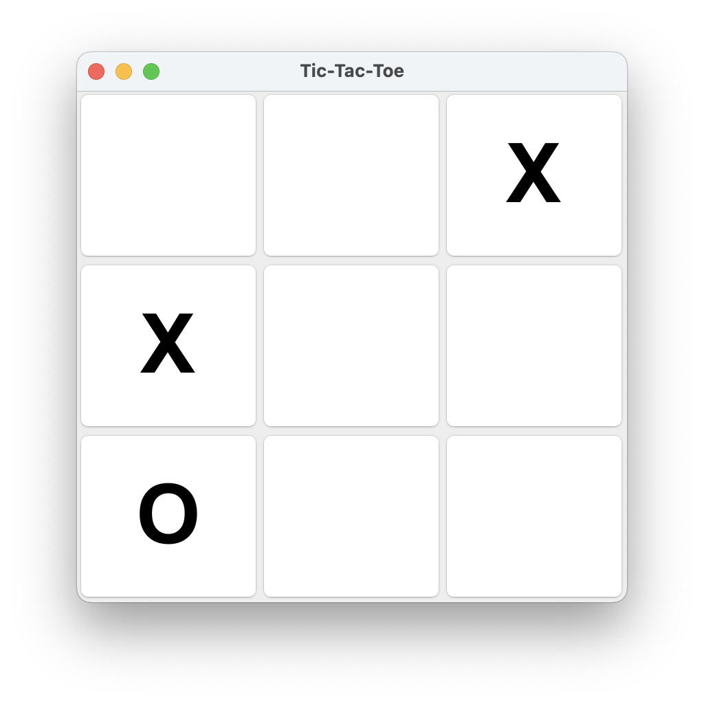
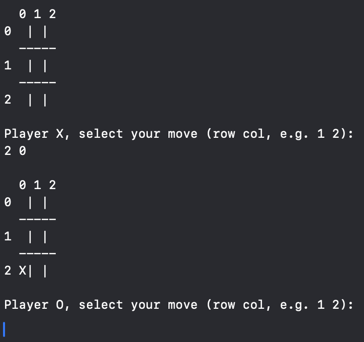

# Tic-Tac-Toe 🕹️

**Tic-Tac-Toe** is a simple implementation of the classic game "Tic-Tac-Toe" (also known as Noughts and Crosses) written in both **Java** (with graphical interface) and **Swift** (with text-based interface). It allows two players to take turns marking spaces on a 3x3 grid, aiming to get three of their marks in a row, column, or diagonal.

The project includes two versions:

- **Java_Tic-Tac-Toe**: A graphical game built using Java Swing.
- **Swift_Tic-Tac-Toe**: A text-based game built using Swift for the terminal.

## ✨ Features

- **Classic Tic-Tac-Toe gameplay**: Play as "X" or "O".
- **Graphical interface (Java version)**: Beautiful UI with buttons for each grid cell.
- **Text-based interface (Swift version)**: Terminal-based gameplay.
- **Win detection**: The game detects when a player wins or when the game results in a draw.
- **Restart option**: After a win or draw, the game can be restarted.

## 🚀 How to Run

1. **Clone the repository**:
   Clone the repository to your local machine:

   ```bash
   git clone https://github.com/Guliveer/Tic-Tac-Toe.git
   ```

### For _Java_:

2. **Set up the project:**
   Ensure that you have Java Development Kit (JDK) installed. You can use any IDE like IntelliJ IDEA, Eclipse, or run the project via terminal.

3. **Run the app:**
   In your IDE or terminal, compile and run the `TicTacToe.java` file to start playing.

### For _Swift_:

2. **Set up the project:**
   Ensure that you have Xcode installed, along with Swift development tools. Open the project in Xcode.

3. **Run the app:**
   Once the project is open in Xcode, press `Cmd + R` to build and run the app.

## 🖥️ Technologies

- **Java**: Using the Swing framework, the Java version provides a simple, classic desktop application for playing Tic-Tac-Toe.
- **Swift**: The Swift version uses a text-based interface to provide a console game experience.

## 📷 Screenshots

|            Java Version             |             Swift Version             |
| :---------------------------------: | :-----------------------------------: |
|  |  |

## 🤝 Contributing

If you'd like to contribute to this project, feel free to fork it and submit a pull request. Any improvements or new features are always welcome!

---

Created with ❤️ by [Oliwer Pawelski](https://github.com/Guliveer)
